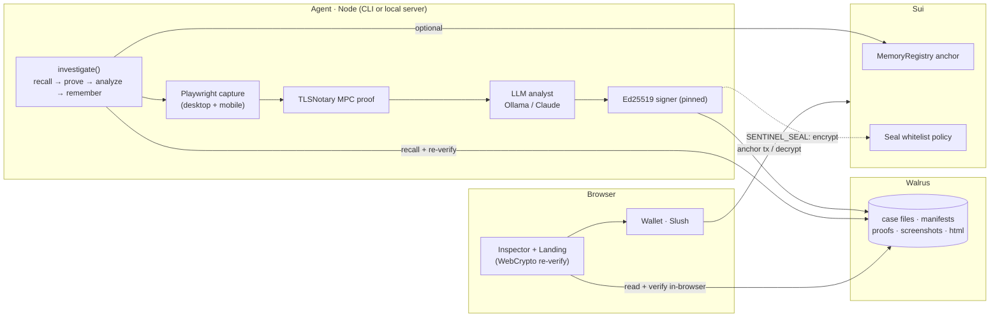
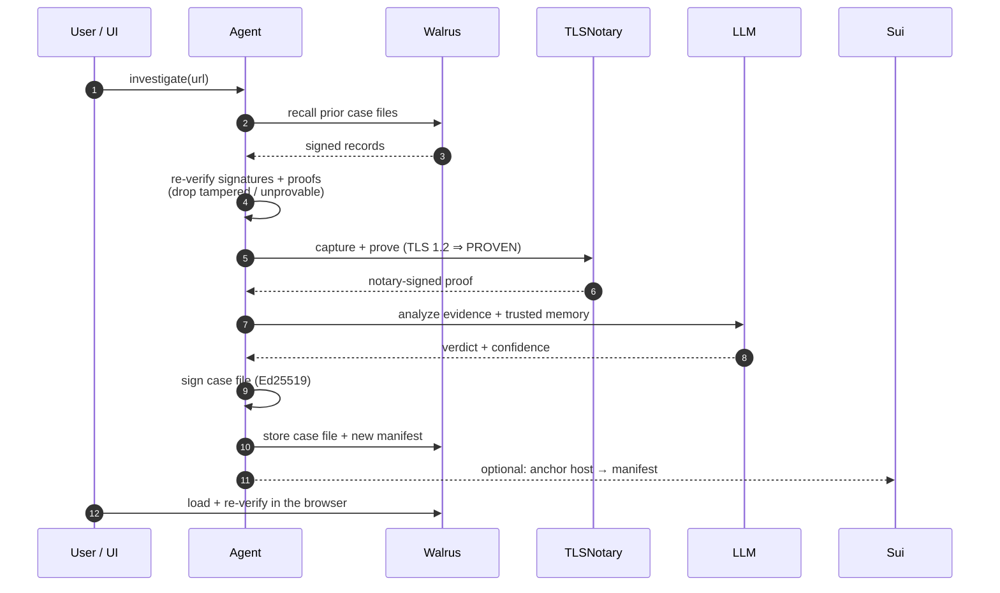
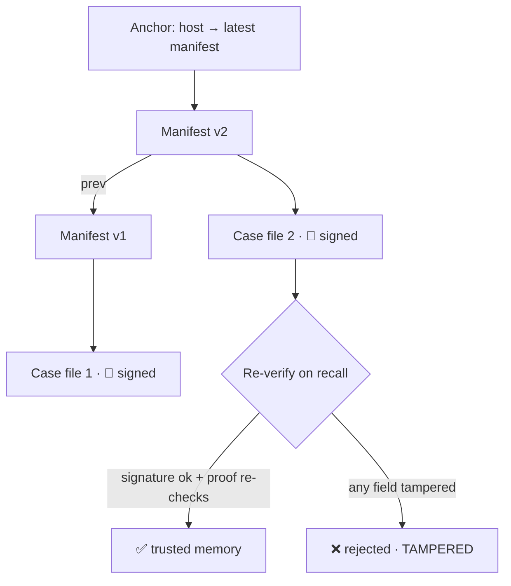
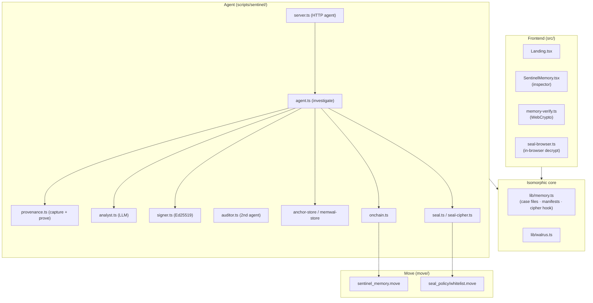

<div align="center">


# SentinelMem

**Memory AI agents can't fake.**&nbsp; Verifiable, append‑only memory for AI agents on
**Walrus** — every record is **Ed25519‑signed**, **TLSNotary‑backed**, and
**re‑verifiable in your browser**. A recalled fact isn't *"the LLM says it saw X"* —
it's *"here's a re‑checkable proof that host X really served X, in a record no one can forge."*


[How it works](#how-it-works) · [Architecture](#architecture) · [Live on testnet](#live-on-sui-testnet-verified) · [Quickstart](#quickstart) · [Verifiable memory](#the-verifiable-memory-guarantee) · [Walrus track](#why-it-fits-the-walrus-track) · [Docs](#documentation)

</div>

---

## The problem

AI agents are stateless and fragmented. The usual fix — *"give the agent a memory
store"* — just relocates the trust problem: naive agent memory is **self‑asserted
text** that an agent (or anyone who can edit the store) can fabricate or silently
corrupt. If agents are going to *act on* their own and each other's memory, that
memory needs **integrity and provenance**, not just persistence.

## What SentinelMem does

A long‑running URL‑investigation agent (security analyst). For each target:

```
investigate(url):
  1. RECALL    load the host's prior case files from Walrus and gate each one:
               (a) verify the agent's Ed25519 signature vs a PINNED key
                   — any edited field breaks it                ⇒ REJECTED
               (b) re-verify the TLSNotary proof bound to THIS host
                   (notary sig → proven host → HTTP 2xx → hash) ⇒ REJECTED if off
               anything tampered / unprovable never reaches the agent.
  2. PROVE     multi-vantage capture + a real TLSNotary MPC proof (PROVEN),
               or a flagged UNVERIFIED capture (TLS 1.3 targets).
  3. ANALYZE   an LLM classifies the target over the proven evidence + the
               trusted recalled memory → phishing / cloaking / suspicious / benign.
  4. REMEMBER  append a new, SIGNED case file to the host's append-only Walrus
               memory; move the pointer (local file, MemWal, or on-chain anchor).
```

A **web inspector** renders each host's memory timeline and **re‑verifies every
record's signature in your browser** (WebCrypto Ed25519) — so anyone can confirm
the memory wasn't tampered, without trusting our server.

---

## How it works



### One investigation, end to end



---

## The verifiable memory guarantee

Each case file is signed with the agent's Ed25519 key over a **canonical message**
of its integrity‑relevant fields; on recall the signature is verified against a
**pinned** signer key. Two independent layers defend the headline claim:

1. **Signature (integrity + authenticity).** Tamper any field — `verdict`, `host`,
   `contentHash`, `renderHash`, `tier`, proof id — and the signature no longer
   matches → **rejected**. A third party can't re‑sign without the agent's key.
2. **Host‑bound proof (provenance truth).** A `PROVEN` entry's TLSNotary proof is
   re‑verified against the entry's **own host** (never an attacker‑supplied field),
   with a mandatory content‑hash match — so a foreign proof can't be swapped in.



The browser inspector verifies the signature client‑side via WebCrypto Ed25519 —
**server‑less confirmation**. Almost any team can put agent memory on Walrus;
SentinelMem makes that memory **unforgeable**.

---

## Why it fits the Walrus track

> *Walrus as a Verifiable Data Platform for AI.*

- **Verifiable memory for AI — made literal.** Walrus is the source of truth, and
  every memory carries cryptographic **integrity** (agent signature) **and**
  **provenance** (TLSNotary). Not a file dump.
- **Long‑running, stateful agent** — recall across sessions changes behavior
  (re‑flags a returning cloaker instantly, "recall‑informed").
- **Multi‑agent, trust‑minimized** — a second **Auditor** agent (distinct key)
  consumes the Analyst's Walrus memory and re‑verifies it by checking the
  *signature*, not by trusting a live peer (`pnpm sentinel:audit`).
- **Artifact‑driven** — proofs, screenshots, HTML, case files, and manifests are
  durable Walrus artifacts the agent reuses.
- **Full Walrus stack** — **Walrus** storage, **MemWal** memory pointer, **Seal**
  encryption, and **Walrus Sites** hosting — all live on testnet.

---

## Live on Sui testnet (verified)

| | |
| --- | --- |
| `sentinel_memory` package | `0xca26b2e73757ee26fd7e32f1f656bcffa81e5bd42b0fe115ca9ba90ee3297c6e` |
| `MemoryRegistry` (shared) | `0x4df6d15626ffde080ab1b5bf15728fc107a7007aa7adfba0eb059a57a21927b5` |
| `MemoryAnchored` event | verified — agent‑driven anchor tx `GjknGzPK5S3ctGKebj8Ndw7PWhQgz1XBy8yt519RA1Dr` |
| **Walrus Site** (inspector UI) | object `0xf416e087b8ea080a6b8e0e2f290e14e6600ef022160c5a3c6904ac38d689cd16` |
| Walrus Site base36 | `630ffwu54fzvssvdjm350s6ecvon1pmtadwv0aqg0pdj4s1o9i` |
| **Seal policy** (`whitelist`) | package `0x96adf5e3d28fe56db65e9aaf205017759a2bc41b4c9f1a0a8f44d037f9c9c167` |
| Seal `Whitelist` (shared) | `0xc43457fae4d6478ef444cdc4155f376f75ee0d4238960f94fc2a269235d7bac1` |

Explore the package on [Suiscan](https://suiscan.com/testnet/object/0xca26b2e73757ee26fd7e32f1f656bcffa81e5bd42b0fe115ca9ba90ee3297c6e).
The inspector is also deployed as a **Walrus Site** (HTML/JS/CSS on Walrus, served
by an on‑chain `Site` object); testnet sites are browsed via a
[self‑hosted portal](https://docs.wal.app/walrus-sites/portal.html#running-the-portal-locally).

---

## Quickstart

### 1. Install

```bash
pnpm install
pnpm exec playwright install chromium   # headless capture (one-time)
```

### 2. Pick an LLM backend

```bash
# Ollama Cloud (used in the demo)
export SENTINEL_LLM=ollama
export OLLAMA_HOST=https://ollama.com
export OLLAMA_KEY=<your-key>
export OLLAMA_MODEL=gpt-oss:120b-cloud
# …or local: ollama serve && ollama pull llama3.1
# …or Claude: pnpm add @anthropic-ai/sdk && export ANTHROPIC_API_KEY=sk-ant-...
```

The LLM choice is **orthogonal** to the verifiable‑memory guarantees — the verdict
is *signed*, not trusted as truth. *(Windows PowerShell: `$env:NAME = "value"`.)*

### 3. Run the agent

```bash
pnpm sentinel "https://example.com/"     # investigate → signed case file on Walrus
pnpm sentinel "https://example.com/"     # again → recalls + re-verifies prior memory
```

### 4. Run the web app (landing + inspector + in‑app Investigate)

```bash
pnpm dev                                 # http://localhost:5173  (landing → connect wallet → inspector)
pnpm sentinel:serve                      # agent server on :8787 — powers the in-app "Investigate" box
```

Memory is **per‑wallet**: connect a wallet and you see (and build) only your own
investigations. The inspector re‑verifies each record's signature in your browser.

### 5. Demos & tests

```bash
pnpm sentinel:tamper example.com         # forge a stored record…
pnpm sentinel "https://example.com/"     # …recall rejects it: "signature invalid — tampered"
pnpm sentinel:audit example.com          # 2nd agent (Auditor) independently re-verifies → CONCUR/DISSENT
pnpm seal:demo                           # Seal: encrypt → Walrus → decrypt (+ denied non-whitelisted reader)
pnpm test                                # security core: sign/verify, tamper-rejection — no network
```

See **[TESTING.md](TESTING.md)** for a click‑by‑click demo flow.

---

## Architecture



| Component | File |
| --- | --- |
| Verifiable memory layer (isomorphic) | `src/lib/memory.ts` |
| In‑browser Ed25519 verify (WebCrypto) | `src/lib/memory-verify.ts` |
| In‑browser Seal decrypt (wallet‑signed) | `src/lib/seal-browser.ts` |
| Landing hero + web inspector | `src/Landing.tsx`, `src/SentinelMemory.tsx` |
| Provenance engine (multi‑vantage capture + prove + re‑verify) | `scripts/sentinel/provenance.ts` |
| Analyst agent (pluggable Ollama/Claude) | `scripts/sentinel/analyst.ts` |
| Orchestrator (`investigate`) + HTTP agent server | `scripts/sentinel/agent.ts`, `server.ts` |
| **Auditor agent** (2nd agent — independent re‑verify) | `scripts/sentinel/auditor.ts`, `audit-cli.ts` |
| Agent record signer (Ed25519, pinned) | `scripts/sentinel/signer.ts` |
| Anchor backends (file / MemWal / on‑chain) | `scripts/sentinel/{anchor-store,memwal-store,onchain}.ts` |
| Seal encryption (policy + cipher adapter) | `scripts/sentinel/{seal,seal-cipher}.ts` |
| Move modules (on‑chain anchor + Seal policy) | `move/scan_market/.../sentinel_memory.move`, `move/seal_policy/.../whitelist.move` |
| Tests | `scripts/sentinel/sentinel.test.ts` |

---

## Environment variables

| Var | Default | Purpose |
| --- | --- | --- |
| `SENTINEL_LLM` | `anthropic` if key set, else `ollama` | Analyst backend |
| `OLLAMA_HOST` / `OLLAMA_KEY` / `OLLAMA_MODEL` | localhost / — / `llama3.1` | Ollama (local or Cloud) |
| `ANTHROPIC_API_KEY` | — | Required only for `SENTINEL_LLM=anthropic` |
| `SENTINEL_VANTAGES` | `desktop,iphone` | Device profiles per investigation (cloaking) |
| `TLSN_NOTARY_URL` | hosted notary | TLSNotary notary endpoint |
| `SENTINEL_PROVE_ATTEMPTS` / `SENTINEL_PROOF_TIMEOUT_MS` | `3` / `240000` | Proof retries / per‑attempt timeout (lower for snappy UNVERIFIED fallback) |
| `SENTINEL_NO_PROOF` | — | Skip TLSNotary (UNVERIFIED tier; signing still active) |
| `SENTINEL_SEAL` | — | `1` → encrypt case files with Seal before Walrus |
| `SENTINEL_EPOCHS` | `5` | Walrus blob lifetime (epochs) |
| `SENTINEL_PORT` | `8787` | Agent server port (`pnpm sentinel:serve`) |
| `SENTINEL_ANCHORS` / `SENTINEL_SIGNER` | `.sentinel/anchors.json` / `.sentinel/agent-key.pem` | Local pointer + signer key |
| `SENTINEL_ANCHOR_ONCHAIN` + `SENTINEL_PKG` + `SENTINEL_MEMORY_REGISTRY` + `SUI_SECRET_KEY` | — | Enable on‑chain anchoring |
| `MEMWAL_ACCOUNT_ID` / `MEMWAL_PRIVATE_KEY` / `MEMWAL_SERVER_URL` | — | Route the pointer through MemWal |
| `VITE_AGENT_URL` / `VITE_SENTINEL_SIGNER` | `localhost:8787` / — | Frontend: agent server URL · pinned signer (public, build‑time) |

---

## Tech stack

**Walrus** (memory + evidence) · **Sui Move** (on‑chain anchor + Seal policy) ·
**Seal** (encryption, live) · **MemWal** (Walrus Memory pointer) · **TLSNotary**
(provenance, headless WASM‑MPC) · pluggable **LLM** (Ollama / Claude) ·
**Walrus Sites** (deployed) · React + Vite + Tailwind inspector with in‑browser
Ed25519 verification · Playwright capture · `@mysten/dapp-kit` wallet.

## Deploy

- **Frontend → Vercel.** `vercel.json` pins the Vite build; **no env required**
  (never put agent secrets in the client). The deployed site is the landing +
  inspector + wallet/anchor/decrypt; the in‑app *Investigate* needs the agent
  server (`pnpm sentinel:serve`, local or self‑hosted via `VITE_AGENT_URL`).
- **Inspector → Walrus Sites.** `pnpm deploy:site` (site‑builder).

## Honest limitations

- **TLS 1.2 only** for `PROVEN` evidence (tlsn alpha.12). Most modern sites are
  TLS 1.3 → stored as a flagged `UNVERIFIED` record (still signed + tamper‑evident,
  never faked as proven). Use `example.com` for a fast `PROVEN` demo.
- The hosted notary is a free‑tier instance that can sleep; the agent retries to
  wake it and degrades gracefully to `UNVERIFIED`.
- The browser badge verifies the **agent signature**; the **TLSNotary proof** is
  re‑checked by the node verifier (the UI links to the proof blob on Walrus).

## Documentation

- **[SENTINELMEM.md](SENTINELMEM.md)** — deep dive, full run guide, on‑chain / MemWal / Seal / Walrus‑Sites activation.
- **[TESTING.md](TESTING.md)** — click‑by‑click demo / test flow.
- **[PITCH.md](PITCH.md)** — problem → solution → track fit → demo script.
- **[DEVPOST.md](DEVPOST.md)** — submission writeup + video storyboard.

## License

Hackathon project — see repository for details.
